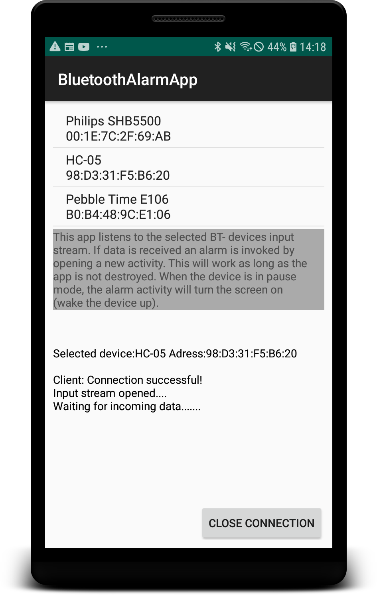

# BlueToothAlarmApp
Demonstrates how to establish a Bluetooth connection and listen for incoming data using a Job Intent service.The device is woken up, if in pause mode as long as the app was not destroyed.

